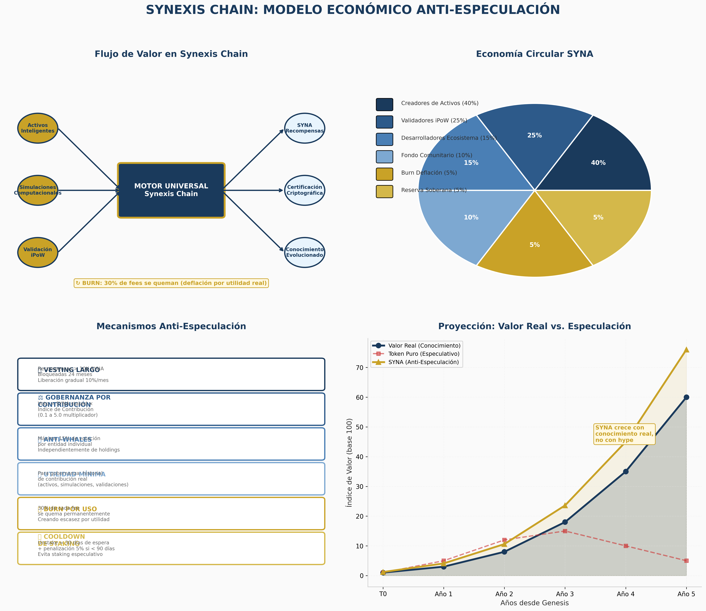

# SYNEXIS ASSET

> La Infraestructura Mundial de Activos Inteligentes

**Synexis Asset** transforma activos del mundo real en **Activos Inteligentes evolutivos**: entidades digitales con identidad propia, historia certificada, capacidad de simulación y relaciones interconectadas mediante inteligencia artificial.

---

## 📖 THE CODEX

El documento maestro que define la filosofía, arquitectura y economía de Synexis Asset.

- [TOMO I — FUNDAMENTOS](./docs/THE_CODEX/TOMO_I_FUNDAMENTOS.md)
- [TOMO II — LA ARQUITECTURA](./docs/THE_CODEX/TOMO_II_ARQUITECTURA.md)
- [TOMO III — EL ECOSISTEMA](./docs/THE_CODEX/TOMO_III_ECOSISTEMA.md)
- [TOMO IV — LA ECONOMÍA](./docs/THE_CODEX/TOMO_IV_ECONOMIA.md)
- [TOMO V — LA PLATAFORMA](./docs/THE_CODEX/TOMO_V_PLATAFORMA.md)
- [TOMO VI — EL FUTURO](./docs/THE_CODEX/TOMO_VI_FUTURO.md)

---

## 🔗 SYNEXIS CHAIN v3.0 — Economía del Descubrimiento

La blockchain soberana de Synexis Asset donde el token **SYNA** solo se emite cuando se genera un **descubrimiento verificable**.

- [01 — Manifiesto del Descubrimiento](./docs/SYNEXIS_CHAIN/01-Manifiesto.md)
- [02 — Triple Verificación](./docs/SYNEXIS_CHAIN/02-Triple-Verificacion.md)
- [03 — Fórmula de Emisión](./docs/SYNEXIS_CHAIN/03-Formula-Emision.md)
- [04 — Anti-Especulación v3.0](./docs/SYNEXIS_CHAIN/04-Anti-Especulacion.md)
- [05 — Gobernanza del Conocimiento](./docs/SYNEXIS_CHAIN/05-Gobernanza.md)
- [06 — Defensas](./docs/SYNEXIS_CHAIN/06-Defensas.md)
- [07 — Conclusión](./docs/SYNEXIS_CHAIN/07-Conclusion.md)

---

## 🏗️ Arquitectura

```
Synexis Asset
├── Motor Universal
│   ├── Identidad Digital
│   ├── Certificación Criptográfica
│   ├── Simulación Computacional
│   ├── Inteligencia Artificial
│   └── Arquitectura Distribuida
├── Digital Twins Evolutivos
├── iPoW (Prueba de Trabajo Inteligente)
└── Synexis Chain (Layer-1 Soberana)
```

---

## 🪙 Token SYNA

| Parámetro | Valor |
|---|---|
| **Hard Cap** | 1,000,000,000 SYNA |
| **Emisión Inicial** | 0 SYNA |
| **Mecanismo de Emisión** | Descubrimiento verificable |
| **Burn** | 30% de fees por utilidad |
| **Gobernanza** | Por contribución (IC), no por holdings |

---

## 🤝 Contribuir

Synexis Asset es una infraestructura abierta. Cada contribuidor que genera conocimiento verificable recibe SYNA y voz en la gobernanza.

[Lee cómo contribuir](./CONTRIBUTING.md)

---

## 📧 Contacto

**Mauro Manuel Herrera Mendoza**  
CEO, CIDCITEI General Trading LLC  
Emiratos Árabes Unidos · China · Venezuela · Estados Unidos

---

*"Cero tokens al inicio. Mil millones de posibilidades. Un solo principio: el conocimiento es la única moneda que nunca se devalúa."*


---

## 📊 Modelo Económico



---

## 🌐 Repositorio

- **GitHub**: https://github.com/cidcitei/synexis-asset
- **Licencia**: MIT (código) + CC BY-SA 4.0 (documentos)
- **Estado**: Activo desarrollo

---

*Documento maestro generado el 25 de julio de 2026*
